# Unix Bench

- [Raspberry Pi 3B](https://htmlpreview.github.io/?https://github.com/kose/benchmark-UnixBench/blob/main/raspi3B-2020-11-20-01.html) : ARM Cortex-A53, 4コア, 1.2GHz
- [Raspberry Pi 4B](https://htmlpreview.github.io/?https://github.com/kose/benchmark-UnixBench/blob/main/raspi4B-2020-11-20-02.html) : ARM Cortex-A72, 4コア, 1.5GHz
- [Raspberry Pi 4B, Ubuntu20.10 (64bit)](https://htmlpreview.github.io/?https://github.com/kose/benchmark-UnixBench/blob/main/raspi4B-ubuntu-2020-11-20-01.html) : ARM Cortex-A72, 4コア, 1.5GHz
- [Mac mini 2018](https://htmlpreview.github.io/?https://github.com/kose/benchmark-UnixBench/blob/main/mini2018-2020-11-15-01.html) : Core i5-8500B, 6コア, 3.00GHz
- [MacBook Pro 2018](https://htmlpreview.github.io/?https://github.com/kose/benchmark-UnixBench/blob/main/MBP2018-2020-11-16-01.html) : Core i5-8259, 8コア, 2.30GHz
- [NUC10i5](https://htmlpreview.github.io/?https://github.com/kose/benchmark-UnixBench/blob/main/nuc10i5-2020-11-15-01.html) : Core i5-10210U, 8コア, 1.60GHz
- [MacBook Air 2020](https://htmlpreview.github.io/?https://github.com/kose/benchmark-UnixBench/blob/main/MBA2020-2020-12-04-01.html) : Apple Silicon (M1), 8コア

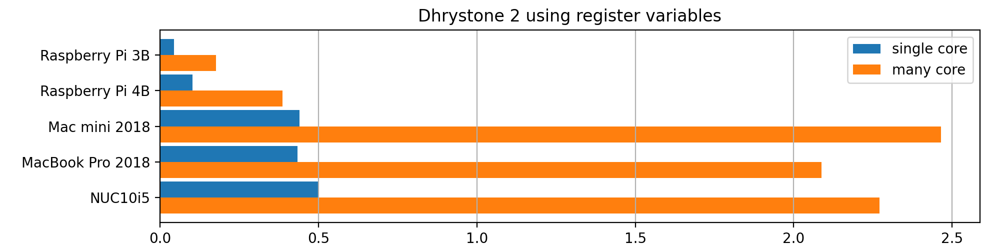
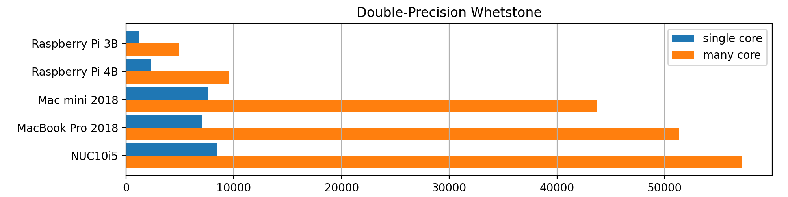
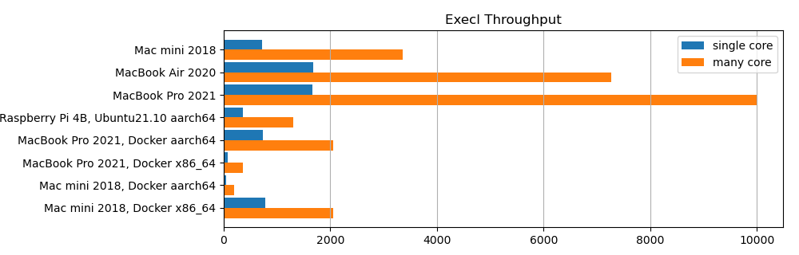
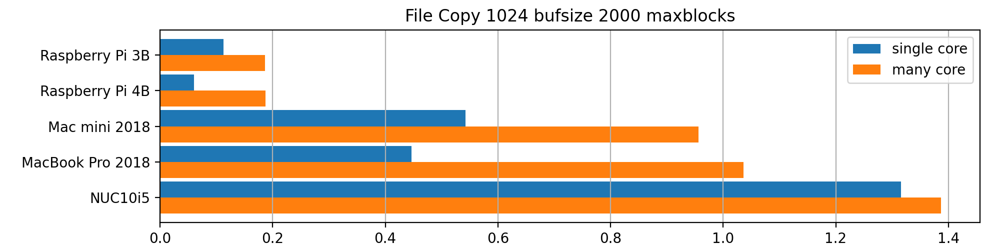
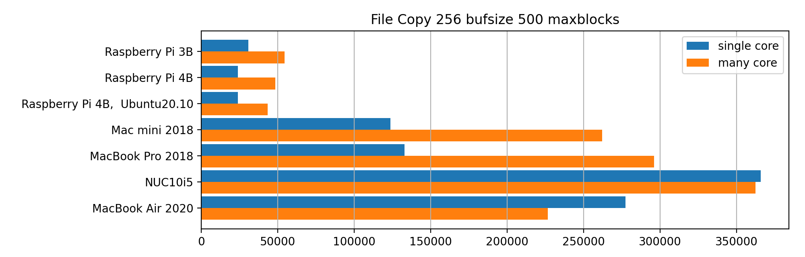
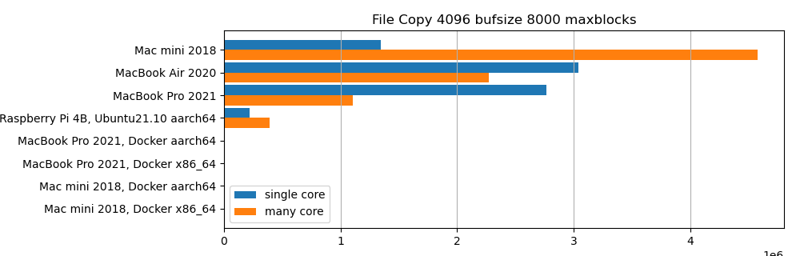
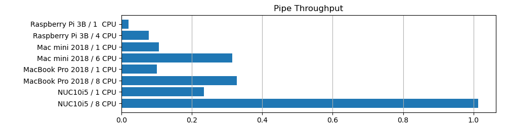
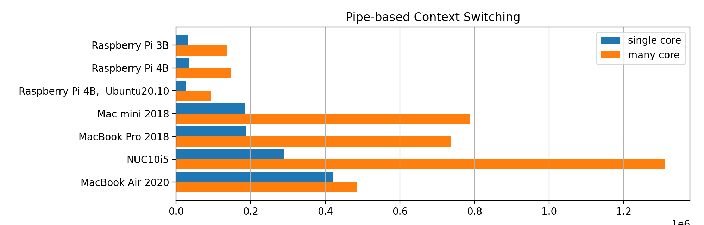
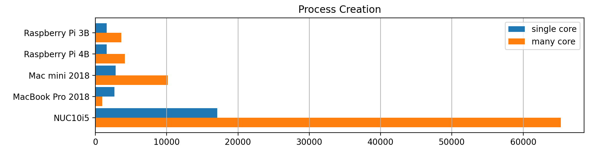
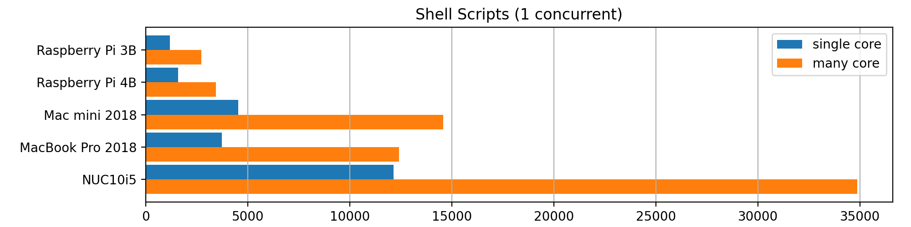
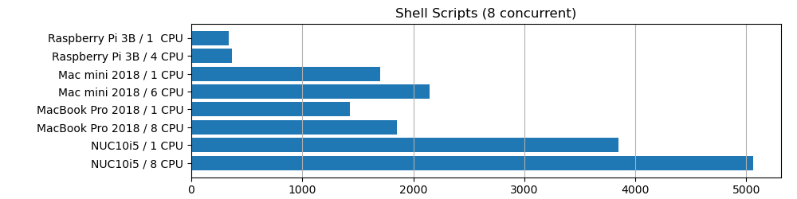
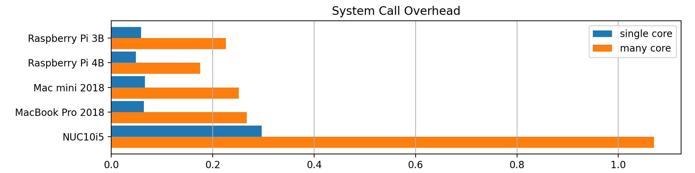
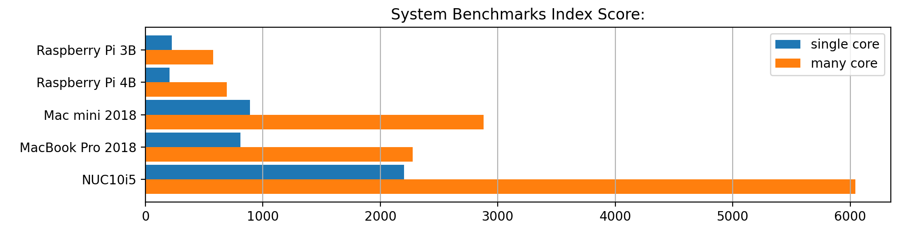

## tools

- [byte-unixbench](https://github.com/kdlucas/byte-unixbench)

## environment

macOS Big Sur, Ubuntu 20.10, Raspberry Pi OS 10.6, SD Card: SanDisk Extreme 64GB V30

