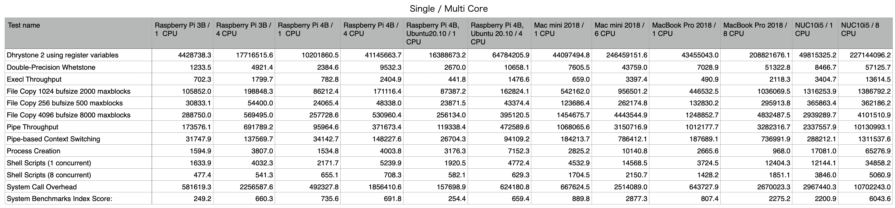

# Unix Bench

- [Raspberry Pi 3B](raspi3B-2020-11-15-01.html)
- [Mac mini 2018](mini2018.local-2020-11-15-01.html)
- [MacBook Pro 2018](MBP2018.local-2020-11-16-01.html)
- [NUC10i5](nuc10i5-2020-11-15-01.html)

